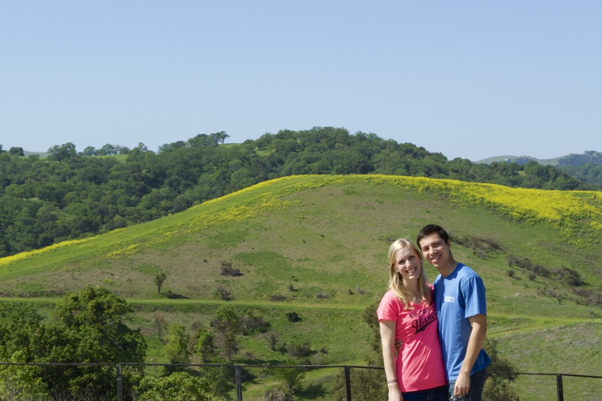

Welcome to Cooking in the Creek! We created this site to share our delicious home-cooked meals with our friends, family and anyone else with a love for food! Our goal is to blog at least 100 recipes.

Megan has developed a love for cooking in last few years, trying out different recipes and being able to add her personal touch to each one. Gabe has a passion for technology and creating beautiful websites. Gabe also fills in as Megan’s Su Chef. We’re putting our two passions together and teaming up in this project to share our culinary adventures – our kitchen is always open!

Most of the recipes found here focus on quick and easy meals for the everyday home cook, using simple, fresh ingredients.

A little about us…we’ve been madly in love for about 4 years and recently were married in September 2015. We’ve always enjoyed cooking and eating together. Mainly, Megan was doing the cooking. After watching an episode of House Hunters in Seattle, we got the idea to start a food blog together with the goal of blogging for at least 100 days.

When we are not in the kitchen, we enjoy cycling, hiking, traveling, critiquing the local restaurants, and watching an unhealthy amount of TV and movies. We live in Walnut Creek, CA, hence the name Cooking in the Creek!

Thank you for visiting our blog. We hope you enjoy our recipes!

This site was built using the Jekyll.

You can find the source code for Minima at GitHub:
[jekyll][jekyll-organization] /
[minima](https://github.com/jekyll/minima)

You can find the source code for Jekyll at GitHub:
[jekyll][jekyll-organization] /
[jekyll](https://github.com/jekyll/jekyll)

[jekyll-organization]: https://github.com/jekyll
